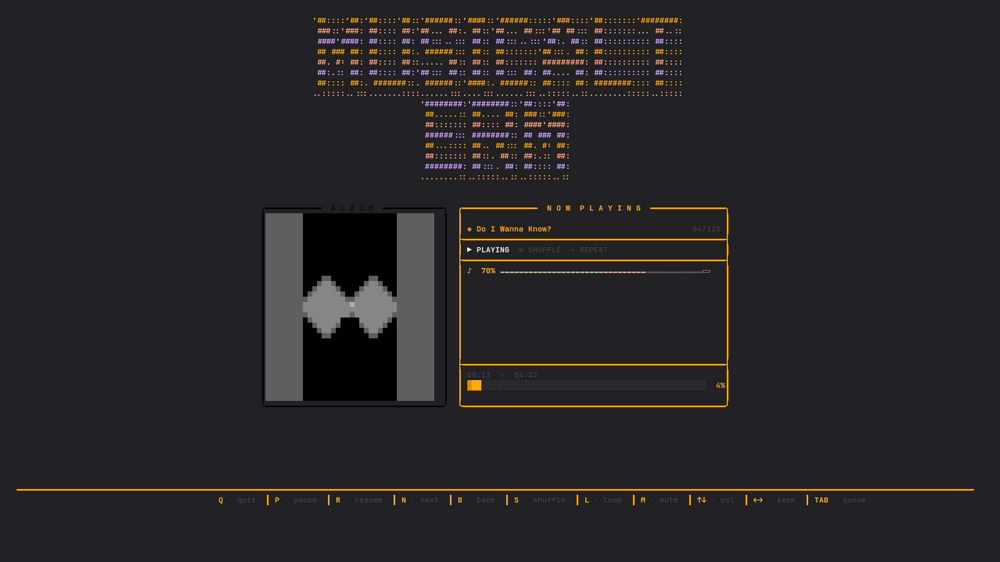

# 🎵 MusicalTerm

**MusicalTerm** is a high-fidelity terminal music player built for people who live inside the command line.

It combines the power of **yt-dlp** and **mpv** with a beautiful **curses-based interface**, letting you stream music, browse queues, and display album art — all without leaving your terminal.


---

# ✨ Features

### 🎧 YouTube Streaming

Play single videos, entire playlists, or plain text searches from **YouTube** and **YouTube Music**.

### 🖼 HD Album Art in Terminal

Album art is rendered directly in the terminal using a **Unicode half-block rendering technique** for improved color depth.

### 🎨 Aesthetic UI

A custom **Dark Obsidian** theme featuring warm amber, deep rose, and soft lavender accents.

### 🔀 True Shuffle

A smart shuffle system that **drains a pool of unplayed tracks**, ensuring every track plays once before repeating.

### 🪟 Dual View Interface

Toggle seamlessly between:

* **Now Playing Dashboard**
* **Queue Browser**

### 🔎 Built-in Search

Paste a URL or type a search query at startup. Search results load directly into the queue.

### ⭐ Favorites and Queue Filters

Mark tracks as favorites, filter the queue by title/channel, and switch between all tracks and favorites.

### 🎭 Theme Cycling

Switch between multiple terminal palettes while the player is running.

### 🎛 Precision Controls

Real-time controls for:

* Volume
* Seeking
* Pause / Resume
* Shuffle
* Loop

### ⚡ Stable Playback

Uses **mpv via IPC (Inter-Process Communication)** for stable and low-latency streaming.

---

# 🖥 Preview



---

# 🛠 Installation

## Prerequisites

Make sure the following are installed:

* **Python 3.8+**
* **mpv**
* **yt-dlp**

Your terminal should support **TrueColor (24-bit)** or at least **256 colors**.

Recommended terminal size:

```
82 x 24
```

---

## Clone the Repository

```
git clone https://github.com/anasarfeen123/MusicalTerm.git
cd MusicalTerm
```

---

## Install Dependencies

```
pip install -r requirements.txt
```

---

# 🚀 Usage

Launch the player with:

```
python main.py
```

1. Paste a **YouTube / YouTube Music URL** or type a search query
2. MusicalTerm will load the tracks
3. Use keyboard shortcuts to control playback

---

# 🎮 Keyboard Shortcuts

| Key       | Action                        |
| --------- | ----------------------------- |
| **TAB**   | Toggle Player / Queue views   |
| **Space/P** | Play / pause playback       |
| **R**     | Resume playback               |
| **N**     | Next track                    |
| **B**     | Previous track                |
| **S**     | Toggle shuffle                |
| **L**     | Toggle loop                   |
| **M**     | Mute / Unmute                 |
| **F**     | Favorite / unfavorite track   |
| **A**     | Show all / favorites in queue |
| **/**     | Filter queue                  |
| **T**     | Cycle theme                   |
| **?**     | Show help overlay             |
| **↑ / ↓** | Volume up / down              |
| **← / →** | Seek backward / forward (10s) |
| **Q**     | Quit MusicalTerm              |

---

# 📂 Project Structure

```
MusicalTerm
│
├── main.py        # Application entry point
├── ui.py          # Curses UI engine and layout
├── player.py      # mpv process and IPC communication
├── core.py        # Metadata extraction and stream resolution
├── artmusic.py    # Image → terminal rendering utility
└── requirements.txt
```

---

# 🧠 How It Works

MusicalTerm combines several tools:

* **yt-dlp** → extracts audio streams and metadata
* **mpv** → handles playback and audio decoding
* **Python curses** → renders the terminal UI
* **IPC sockets** → allows real-time control of mpv

This architecture allows responsive controls while streaming audio efficiently.

---

# 📌 Roadmap

Planned improvements:

* YouTube search inside the terminal
* Cached playback
* Lyrics support
* Playlist saving
* Background playback mode

---

# 🤝 Contributing

Contributions are welcome!

If you'd like to improve MusicalTerm:

1. Fork the repository
2. Create a feature branch
3. Submit a pull request

---

# 📜 License

This project is licensed under the **MIT License**.

---

# ⭐ Support

If you like this project, consider **starring the repository** on GitHub!
